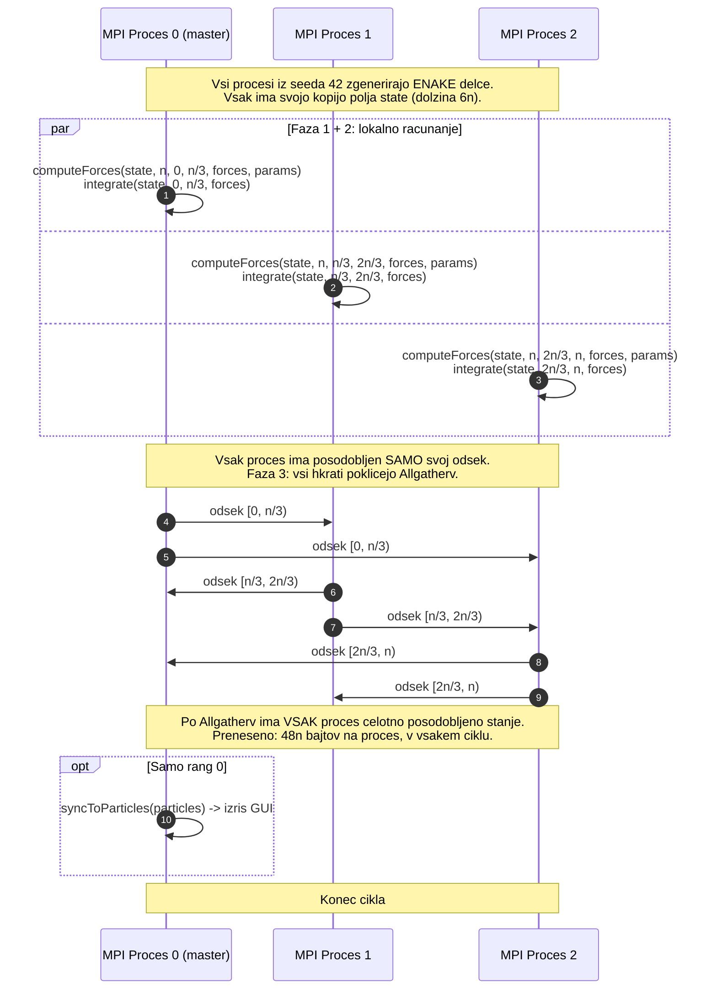

# Porazdeljeni način delovanja (Distributed Mode)

V porazdeljenem načinu teče **več ločenih procesov**, ki si **ne delijo pomnilnika**. Diagram prikazuje potek izračuna in sinhronizacije s kolektivno operacijo `Allgatherv`.



## Razdelitev delcev

Prvih `n mod size` procesov dobi en delec več:

```java
private int startIndexOf(int r) {
    int base = n / size;
    int remainder = n % size;
    return (r < remainder) ? r * (base + 1)
                           : remainder * (base + 1) + (r - remainder) * base;
}
```

Ker `startIndexOf(size)` vrne `n`, je konec območja procesa `r` kar `startIndexOf(r + 1)`. Primer z 10 delci in 3 procesi: rang 0 dobi `[0, 4)`, rang 1 `[4, 7)`, rang 2 `[7, 10)`.

## Podrobnosti komunikacije

- **SPMD (Single Program, Multiple Data)**: vsi procesi zaženejo isti program in računajo enakovredno. Master (rang 0) se razlikuje samo po tem, da izpisuje rezultate in odpre grafično okno.

- **`Allgatherv`**: kolektivna operacija "vsi zberejo vse, različne količine". Omogoča pošiljanje poljubno velikih kosov (`recvCounts`) na poljubne odmike (`displacements`), kar je potrebno, ker se število delcev na proces lahko razlikuje. To je **edina komunikacijska točka** v ciklu.

> [!NOTE]
> **Zakaj ne Scatter + Gather?**
> Pri Scatter/Gather bi celoten rezultat imel samo rang 0 in bi ga moral znova razposlati (Broadcast). Z `Allgatherv` **vsi** procesi hkrati prejmejo celotno stanje — ena operacija namesto dveh.

> [!NOTE]
> **Zakaj potrebuje vsak proces vse delce?**
> Ker je sila na delec $i$ vsota sil **vseh** ostalih $n-1$ delcev. Delec na rangu 0 čuti silo delcev na rangu 1 in 2. To je inherentna lastnost N-body problema, ne pomanjkljivost izvedbe.

## Cena komunikacije

Vsak proces prenese $6 \cdot 8 \cdot n = 48n$ bajtov na cikel. Pri $n = 2000$ je to 96 kB na proces, in to v **vsakem** ciklu.

## Izmerjeno

Porazdeljena različica je na enem računalniku **počasnejša od vzporedne**, kar je pričakovano: obe razdelita enako delo med enako število izvajalcev, a porazdeljena mora vsak cikel še prekopirati stanje med procesi. Nobeno od tega kopiranja ne pripomore k izračunu — obstaja samo zato, ker procesi ne vidijo pomnilnika drug drugega.

Zanimivejši od posamezne številke je **trend**. Komunikacija raste kot $O(n)$, računanje pa kot $O(n^2)$, zato mora delež časa za komunikacijo z večanjem problema padati:

| $n$ (1000 ciklov) | Vzporedna [s] | Porazdeljena $P=10$ [s] | Porazdeljena počasnejša za |
|---|---|---|---|
| 500 | 0,161 | 0,608 | 278 % |
| 1000 | 0,467 | 0,798 | 71 % |
| 2000 | 1,453 | 2,386 | 64 % |
| 3000 | 4,159 | 5,416 | **30 %** |

Pri $n = 500$ je porazdeljena različica z 10 procesi celo **počasnejša od sekvenčne** (pohitritev $0{,}72\times$): računanja na cikel je tako malo, da 1000 klicev `Allgatherv` prevlada nad celotnim časom izvajanja. To je najlepši primer v naših podatkih, da paralelizacija ni brezplačna.

Število procesov, ki je optimalno, je odvisno od velikosti problema:

| $n$ | $P = 4$ [s] | $P = 10$ [s] | Zmagovalec |
|---|---|---|---|
| 500 | 0,252 | 0,608 | $P = 4$ (cenejša kolektivna operacija) |
| 3000 | 7,716 | 5,416 | $P = 10$ (dovolj računanja za dodatne procese) |

> [!IMPORTANT]
> **Kdaj se porazdeljeni model izplača?**
> Porazdeljena različica plačuje za **zmožnost**, ki je en računalnik ne potrebuje: delovanje v ločenih naslovnih prostorih. Njena prednost se pokaže šele, ko procesi tečejo na **različnih računalnikih** — takrat sta na voljo skupni pomnilnik in skupno število jeder več strojev, s čimer presežemo mejo enega računalnika. Znotraj enega računalnika te prednosti ni, zato je komunikacija čisti režijski strošek.
