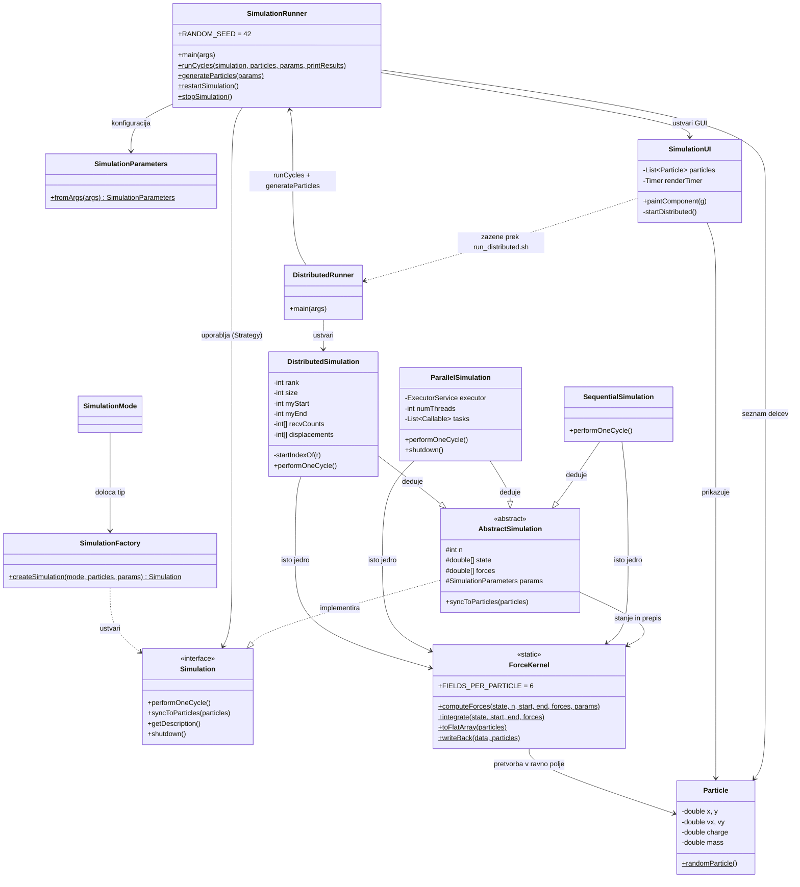

# Arhitektura sistema (Splošni pregled)

Diagram prikazuje odnose med ključnimi razredi. Uporabljena sta vzorca **Strategija (Strategy)** prek vmesnika `Simulation` in **Tovarna (Factory)** prek razreda `SimulationFactory`.

Ključna lastnost zasnove: vsi trije načini računajo z **istim jedrom** (`ForceKernel`) nad **istim stanjem** (`AbstractSimulation`) in tečejo v **isti zanki** (`SimulationRunner.runCycles`). Razlikujejo se samo v tem, kdo izračuna kateri odsek delcev.

## Opis modulov

- **Vstopni točki**: `SimulationRunner` (sekvenčni in vzporedni tek) ter `DistributedRunner` (porazdeljeni tek prek MPJ).
- **Skupno jedro**: `ForceKernel` vsebuje vso fiziko — Coulombovo silo, mejne sile in Eulerjevo integracijo. Uporabljajo ga vsi trije načini.
- **Skupno stanje**: `AbstractSimulation` hrani ravno polje delcev in polje sil. Ker je stanje enako pri vseh, se podrazredi razlikujejo samo po delitvi dela.
- **Strategija**: vmesnik `Simulation` določa pogodbo za en časovni korak.
- **Podatkovni model**: `Particle` predstavlja delec, `SimulationParameters` pa nastavitve in branje ukazne vrstice.

## Zakaj ta zasnova

> [!IMPORTANT]
> Primerjava izvedbenih modelov je smiselna **samo**, če vsi izvajajo isti algoritem. Če bi vsak način imel svojo kopijo fizike ali svojo podatkovno postavitev, bi izmerjena razmerja odražala te razlike in ne učinka paralelizacije. Z enim jedrom, enim stanjem in eno zanko merimo natanko to, kar želimo meriti.
