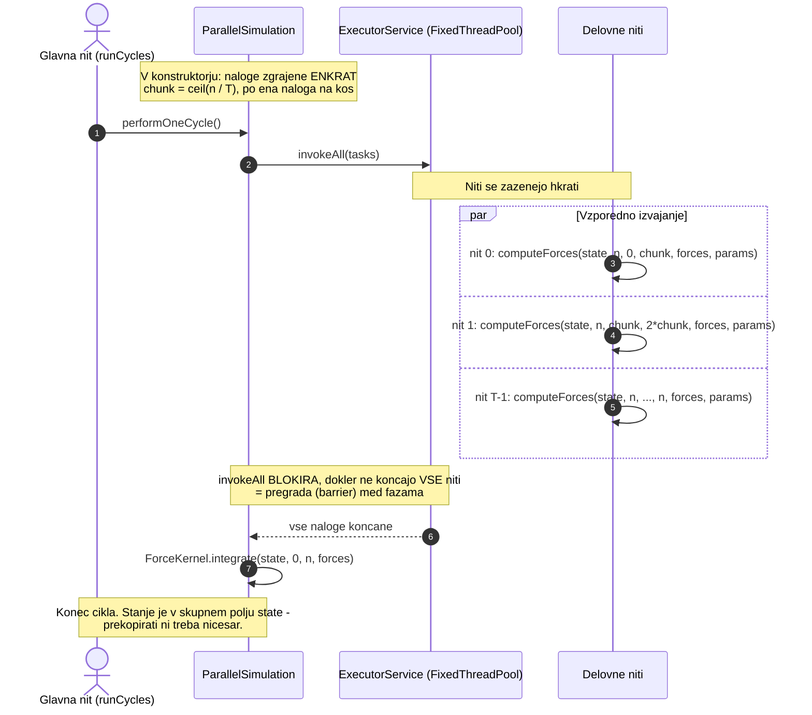

# Vzporedni način delovanja (Parallel Mode)

Vzporedni način uporablja **niti z deljenim pomnilnikom**. Diagram prikazuje, kako se izračun sil paralelizira med $T$ delovnih niti z uporabo pregrade `invokeAll`.



## Koda

```java
// V konstruktorju - naloge se ne spreminjajo, zato jih zgradimo enkrat
int chunk = (n + numThreads - 1) / numThreads;
for (int t = 0; t < numThreads; t++) {
    final int start = Math.min(t * chunk, n);
    final int end   = Math.min(start + chunk, n);
    if (start < end) {
        tasks.add(() -> {
            ForceKernel.computeForces(state, n, start, end, forces, params);
            return null;
        });
    }
}

// V vsakem ciklu
public void performOneCycle() {
    executor.invokeAll(tasks);                   // FAZA 1 + pregrada
    ForceKernel.integrate(state, 0, n, forces);  // FAZA 2
}
```

## Podrobnosti sinhronizacije

- **Brez zaklepanja na podatkih**: delovne niti pišejo sile v skupno polje `forces`, ki je **globalno indeksirano** (`forces[i*2]`, `forces[i*2+1]`). Ker vsaka nit piše le v svoj razpon indeksov, med njimi ni sporov in zaklepanje ni potrebno. To je primer **prostorske dekompozicije**.

- **Pregrada**: `invokeAll()` odda vse naloge in se vrne **šele ko so vse končane**. Preprečuje, da bi se posodobitev pozicij začela, preden so znane vse sile.

> [!NOTE]
> **Zakaj `invokeAll()` in ne `submit()` s `CountDownLatch`?**
> `invokeAll()` že vsebuje pregrado, zato števca ni treba ročno ustvarjati, zmanjševati in čakati nanj. Manj kode pomeni manj možnosti za napako: pozabljen `countDown()` v veji z izjemo bi glavno nit blokiral za vedno.

- **Zakaj je Faza 2 sekvenčna**: Faza 2 je $O(n)$, Faza 1 pa $O(n^2)$. Pri $n = 3000$ je to 3000 proti 9 milijonom operacij — paralelizacija Faze 2 bi prinesla zanemarljiv prihranek, uvedla pa dodatno sinhronizacijo.

- **Lažno deljenje (false sharing)**: niti pišejo v sosednje dele polja `forces`, zato lahko na **mejah kosov** pride do prehajanja predpomnilniških vrstic. Ker so kosi veliki (pri $n = 2000$ in 10 nitih 200 delcev = 3200 bajtov = točno 50 predpomnilniških vrstic), se to zgodi le na stičnih točkah in ne vpliva bistveno na zmogljivost.

## Izmerjeno

Vzporedna različica je **najhitrejša na enem računalniku pri vseh izmerjenih velikostih problema**.

| $n$ (1000 ciklov) | Sekvenčna [s] | Vzporedna [s] | Pohitritev | Učinkovitost |
|---|---|---|---|---|
| 500 | 0,440 | 0,161 | 2,73× | 27,3 % |
| 1000 | 1,733 | 0,467 | 3,71× | 37,1 % |
| 2000 | 6,944 | 1,453 | **4,78×** | 47,8 % |
| 3000 | 15,665 | 4,159 | 3,77× | 37,7 % |

> [!IMPORTANT]
> **Zakaj pohitritev ne doseže 10× na 10-jedrnem procesorju?**
> Apple M4 ima **4 zmogljiva (P) in 6 varčnih (E) jeder**. Prve štiri niti dobijo P-jedra in prispevajo skoraj polno zmogljivost, naslednjih šest pa E-jedra, ki so bistveno počasnejša. Ker so kosi **enako veliki** in je na koncu vsakega cikla **pregrada**, vsi čakajo na najpočasnejšega. Zato je učinkovitost pri 4 izvajalcih (51–73 %) mnogo višja kot pri 10 (22–29 %).
>
> Rešitev bi bila delitev kosov sorazmerno z zmogljivostjo jedra ali dinamično dodeljevanje dela (work stealing).
