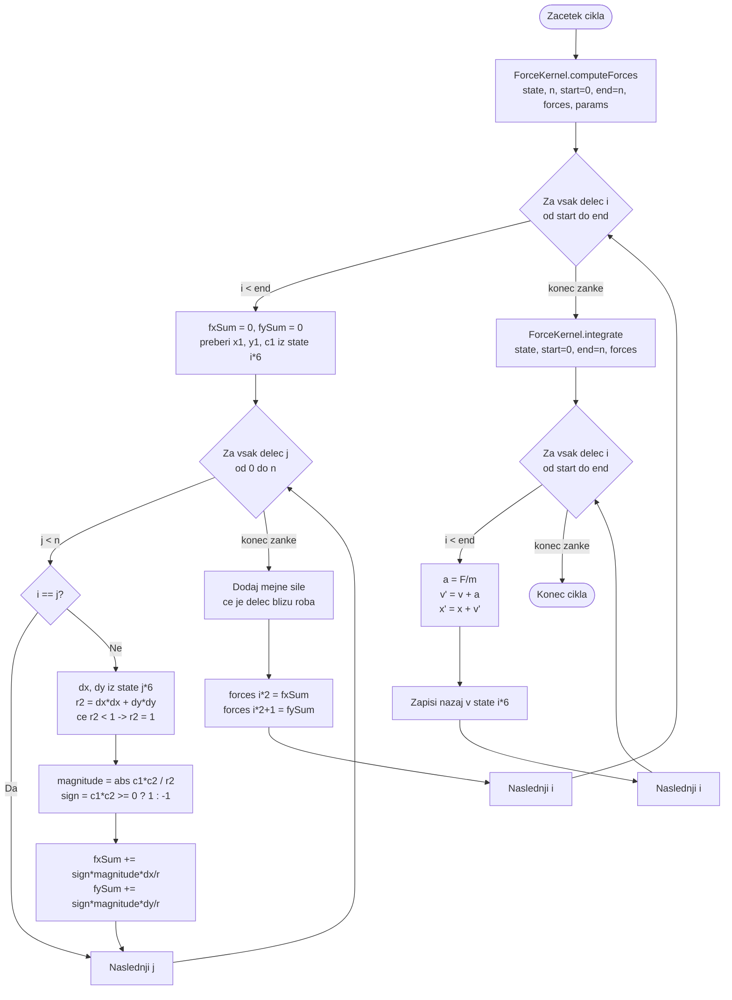

# Sekvenčni način delovanja (Sequential Mode)

V sekvenčnem načinu se celotna simulacija izvaja v **eni sami niti**. Diagram prikazuje potek enega cikla nad ravnim poljem `state`.



## Koda

Celotna sekvenčna izvedba sta samo dva klica skupnega jedra:

```java
public void performOneCycle() {
    ForceKernel.computeForces(state, n, 0, n, forces, params);
    ForceKernel.integrate(state, 0, n, forces);
}
```

Vzporedna in porazdeljena različica kličeta **isti dve metodi**, le z drugimi mejami območja `[start, end)`.

## Analiza

Notranja zanka (`j < n`) je gnezdena znotraj zunanje (`i < n`), kar da $n \cdot (n-1)$ izračunov sile na cikel.

- **Kompleksnost**: Faza 1 je $O(n^2)$, Faza 2 je $O(n)$, skupaj $O(n^2)$ na cikel.
- **Prednost**: ni nobenega režijskega stroška sinhronizacije ali komunikacije. Pri majhnem $n$ je to najhitrejša izbira — pri $n = 500$ je sekvenčna različica celo hitrejša od porazdeljene z 10 procesi.
- **Slabost**: uporablja samo eno jedro. Pri večjem $n$ je zato bistveno počasnejša od ostalih dveh načinov.

## Zakaj dvofazni algoritem

> [!IMPORTANT]
> Sile se **najprej izračunajo za vse delce**, šele nato se posodobijo pozicije. Če bi pozicije posodabljali sproti, bi nekateri delci že imeli nove pozicije, drugi pa še stare — rezultat bi bil odvisen od vrstnega reda obdelave. Z dvofaznim pristopom vsi delci "vidijo" enako stanje znotraj istega cikla, kar je tudi pogoj, da vsi trije načini dajo enak rezultat.

## Izmerjeno

Cena enega cikla pri $n = 2000$ je konstantna, ne glede na dolžino teka:

| Cikli | Čas [s] | Cena cikla [ms] |
|---|---|---|
| 250 | 1,782 | 7,13 |
| 500 | 3,499 | 7,00 |
| 1000 | 6,944 | 6,94 |
| 2000 | 13,952 | 6,98 |

Rast s številom delcev potrjuje $O(n^2)$: pri podvojitvi $n$ se čas početveri (izmerjeno 3,94 in 4,01 proti pričakovanemu 4,00).
